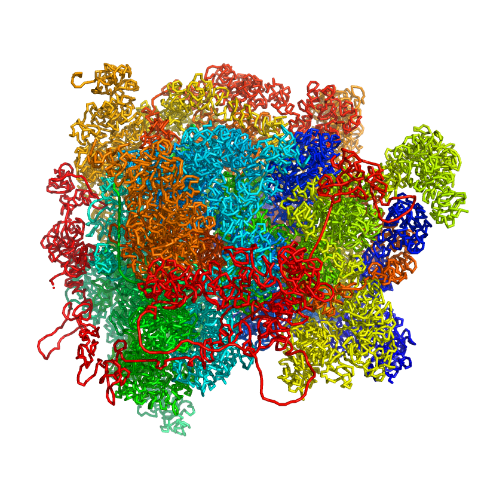
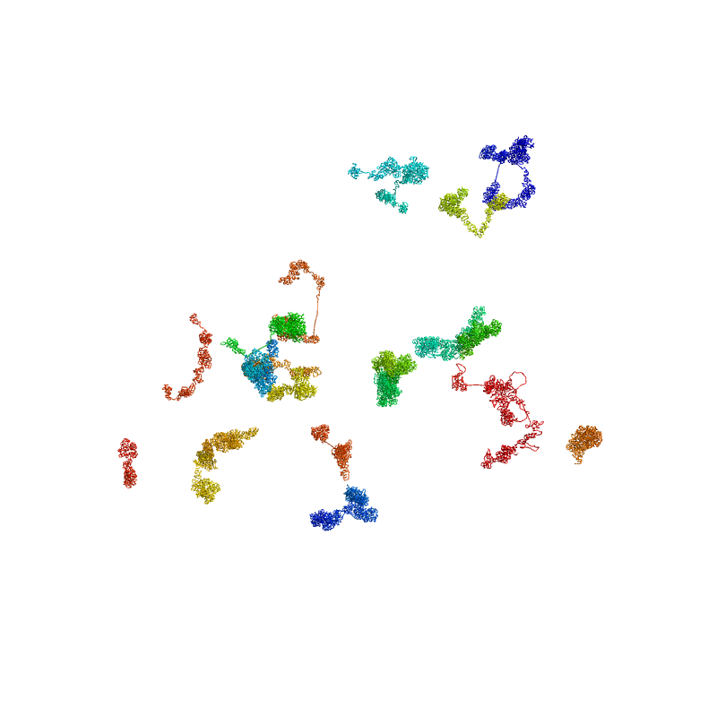

3D model the sc3DG
======================

Reconstructing the 3D structure of chromatin from a contact matrix involves several steps.
Initially, the contact matrix undergoes preprocessing to eliminate noise and adjust its resolution.
Following this, distance constraints are derived from the matrix, which serve as the foundation for
establishing the 3D structure. Then, Monte Carlo simulation is employed to find chromatin structures
that align with these constraints.
We refer to the nuc_dynamics for the code implementation of this function.

To model the 3D structure

.. code-block:: shell

    stark model   --pair /absolute/path/to/data/3dmodel/test.pairs.gz \
        --output /absolute/path/to/result/3dmodel/test_100.pdb \
        --num_models 5 \
        --iter_steps 500 \
        --iter_res 8e6,4e6,2e6,4e5,2e5,1e5

The reuslt can be visualized in pymol as follows:

To get seperated chromatin chains, you can use the following command:

.. code-block:: shell

    translate [0, 0, 0], chain a
    translate [80, 0, 0], chain b
    translate [0, 80, 0], chain c
    translate [0, 0, 80], chain d
    translate [80, -20, 0], chain e
    translate [80, 0, 0], chain f
    translate [60, 20, 0], chain g
    translate [60, -20, 0], chain h
    translate [60, -40, 0], chain i
    translate [20, -40, 0], chain j
    translate [40, -40, 0], chain k
    translate [40, -60, 0], chain l
    translate [30, -50, 0], chain m
    translate [40, -50, 0], chain n
    translate [40, -60, 0], chain o
    translate [60, -60, 0], chain p
    translate [80, 0, 0], chain q
    translate [80, -30, 0], chain r
    translate [40, -50, 0], chain s
    translate [0, -60, 0], chain t

The result like this:

