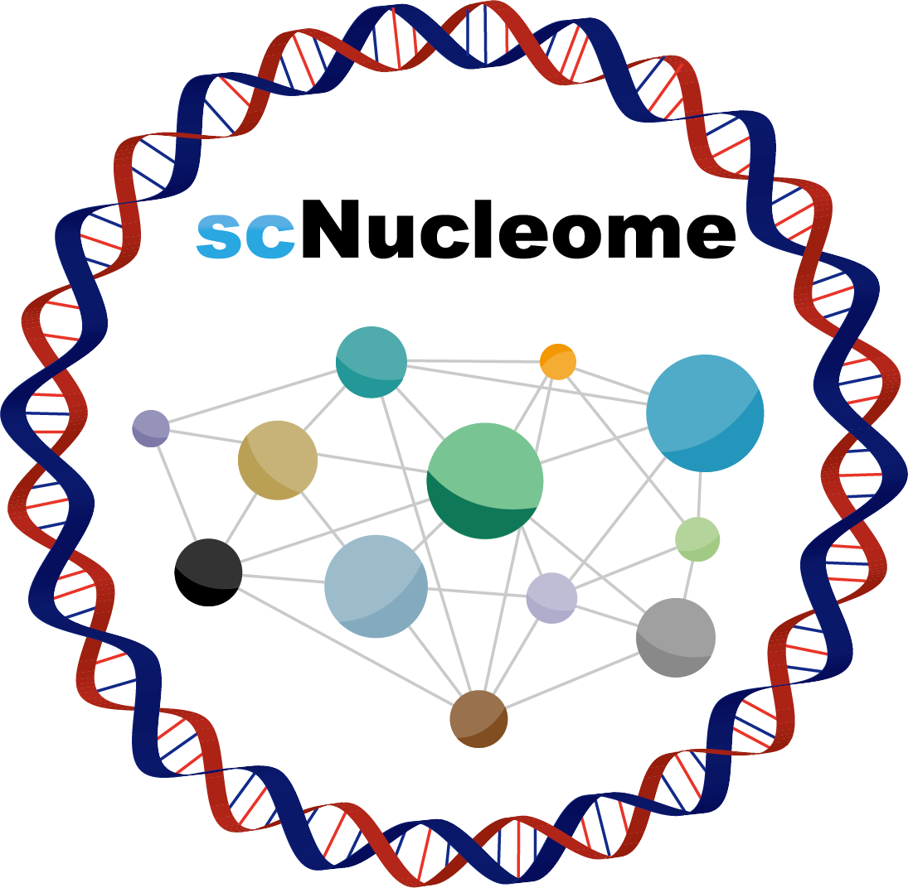

What's the STARK?
===================

sc3DG-seq has emerged as an essential tool for understanding the variability in 3D chromatin structure among individual cells. The process encompasses cell sorting, chromosome cross-linking, digestion, ligation, and sequencing, culminating in a map of interactions across the genome. Despite the development of over ten distinct sc3DG-seq techniques, each with unique processing requirements, a unified computational framework has been lacking. This gap poses a significant challenge to the research community, hindering the effective utilization of these extensive and valuable data.

To address this challenge, we propose STARK, a unified framework that conducts preprocessing, quality control and downstream analysis for all current sc3DG-seq data types (Fig S1). STARK encompasses three modules: Preprocess, Cell QC (Quality Control) and Downstream Analysis.

STARK is a  software for processing various types of sc3DG-seq sequencing data,
which currently includes the sc3DG-seq technologies as follows:

* scHi-C (`Nagano et al., 2013 <https://www.nature.com/articles/nature12593>`_)
* scHi-C+ (`Argelaguet et al., 2019 <https://www.nature.com/articles/s41587-019-0382-x>`_)
* Dip-C (`Tan et al., 2018 <https://www.nature.com/articles/s41586-018-0462-y>`_)
* HiRES (`Wang et al., 2023 <https://www.nature.com/articles/s41592-023-01883-2>`_)
* sn-m3C (`Lee et al., 2019 <https://www.nature.com/articles/s41592-019-0547-z>`_)
* scSPRITE (`Quinodoz et al., 2018 <https://www.cell.com/cell/fulltext/S0092-8674(18)31248-6>`_)
* sciHi-C (`Ramani et al., 2017 <https://www.nature.com/articles/nmeth.4155>`_)
* snHi-C (`Lee et al., 2019 <https://www.nature.com/articles/s41592-019-0547-z>`_)
* scNanoHi-C (`Lee et al., 2022 <https://www.nature.com/articles/s41587-022-01289-z>`_)
* scMethyl-HiC (`Li et al., 2019 <https://www.nature.com/articles/s41592-019-0502-z>`_)
